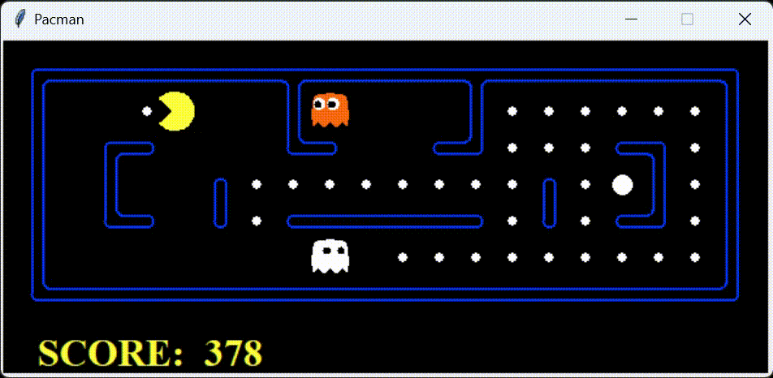

# HW2: Multi-Agent Search
In this homework, you will design agents for the classic version of Pacman, including ghosts. Along the way, you will implement both minimax and expectimax search and try your hand at evaluation function design.

This homework includes an autograder for you to grade your answers on your machine. This can be run on all questions with the command:
```
python autograder.py
```
## Searching 
Based on different heuristic with position score, ghost number and position, food density and also the capsule. The agent is expanded into state space tree and try on `minmax` and `expectimax`, with alpha-beta prunning as well.
<div align="center">
  
</div>
