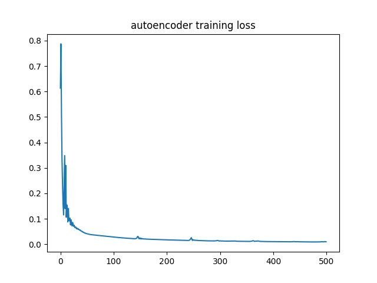

# Hw4: PCA and Autoencoder
pca, autoencoder and denoise autoencoder for image feature extraction and reconstruction.

## Programming
Finish the functions with `#TODO` in the following files:
* `hw4.py`
* `src/pca.py`
* `src/autoencoder.py`

## Traning Loss 
The traning loss plot of autoencoder and denoise autoencoder. 

| autoencoder | denoise autoencoder |
| -- | -- |
||
